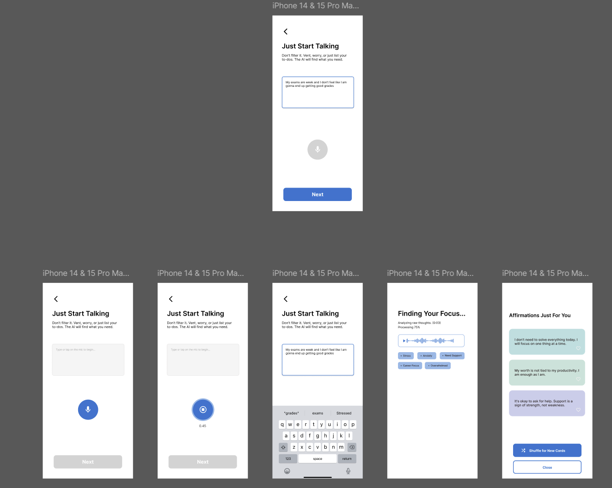

# Full Process 4 (FP-04) - "The Contextual Mirror"

## Product Requirements Document

**Version:** 1.0
**Date:** 2025-12-17
**Based on:** Concept A from "Fresh Takes on Aiffirmations - UX Strategy Thoughts"

---

## Overview

Full Process 4 implements **Concept A: "The Contextual Mirror"** - a minimal-friction affirmation generation experience that shifts cognitive burden from the user to the AI backend.

### Core Concept

> "One unstructured input → AI Structure"

The user vents freely in natural language. The AI extracts emotional themes/tags and generates personalized affirmations. No forms, no multi-step wizards, no category selection.

### User Mental Model

**Therapy / Confidant** - The app feels like talking to someone who listens and understands.

---

## Problem Statement

The original "Linear Wizard" prototype (Input → Select → Select → Result) creates **High Interaction Friction**. For users who are overwhelmed, stressed, or impatient, being forced to categorize their emotions before receiving support is a barrier to entry.

### Key Insight

Users don't need to know what they're feeling yet. The AI can figure it out.

---

## User Flow

### Screen 1: The Open Invitation

**Title:** "Just Start Talking"
**Subtitle:** "Don't filter it. Vent, worry, or just list your to-dos. The AI will find what you need."

**Elements:**
- Large text area (placeholder: "Type to begin...")
- "Next" button (disabled until text is entered)
- Back navigation

**UX Logic:**
- The prompt "Don't Filter It" grants permission to be messy
- Large target area requires no navigation
- **Constraint Solved:** User doesn't need to know what they're feeling yet

---

### Screen 2: Visualization of Intelligence

**Title:** "Finding Your Focus..."
**Subtitle:** "Analyzing raw thoughts. Processing..."

**Elements:**
- Progress indicator (optional)
- Tag chips appearing one by one with ~1 second staggered delay
- Tags are **read-only** (no editing)

**Example Tags:**
- `• Stress`
- `• Anxiety`
- `• Need Support`
- `• Career Focus`
- `• Overwhelmed`

**UX Logic:**
- Instead of asking the user to select "Anxiety" or "Career," the AI visually extracts these tags
- This **"Magic Moment"** proves the backend is listening
- Justifies the value of the app immediately
- Staggered appearance creates sense of AI "thinking" (even though all tags come from one API call)

**Behavior:**
- All tags are fetched in a single backend call
- Frontend reveals them one at a time with 1-second intervals
- After all tags displayed, auto-transition to results (or brief pause then transition)

---

### Screen 3: Personalization & Agency

**Title:** "Affirmations Just For You"

**Elements:**
- Affirmation cards in a vertical list
- Each card has:
  - Affirmation text
  - Heart/save button (right side of card)
- "Shuffle for New Cards" button (primary action)
- "Close" button (secondary action)

**Card Styling:**
- Soft colored backgrounds (mint green, light blue, lavender)
- Rounded corners
- Heart icon toggles filled/unfilled on tap

**UX Logic:**
- Results presented in card format
- **The "Heart" Interaction:** Save function inside the card creates micro-commitment to specific content rather than "Save All"
- Provides better signal for future algorithm improvements

**Shuffle Behavior:**
- Regenerates affirmations using same extracted context
- Preserves saved affirmations (they don't disappear)
- Tracks shown affirmations to avoid repetition
- **Feedback Loop:** Sends liked (saved) and skipped affirmations to the agent as signals for generating better-matching affirmations

---

## Technical Architecture

### New Agent: FP-04

Create a new Mastra agent with two capabilities:

#### 1. Tag Extraction
- Input: Raw user text (unstructured)
- Output: Array of emotional/contextual tags (3-6 tags)
- Example tags: Stress, Anxiety, Self-doubt, Career, Relationships, Health, Overwhelmed, Need Support, Growth, Change

#### 2. Affirmation Generation
- Input: Extracted tags + user's original text
- Output: Array of personalized affirmations (6-8)
- Uses existing affirmation quality guidelines from FP-03

### API Design

```typescript
// Single API call that returns both tags and affirmations
interface FP04GenerateRequest {
  userInput: string;              // Raw unstructured text
  previousAffirmations?: string[];  // For shuffle - avoid repeats
  savedAffirmations?: string[];     // Liked - generate MORE like these
  skippedAffirmations?: string[];   // Not liked - avoid similar style/tone
}

interface FP04GenerateResponse {
  tags: string[];              // Extracted emotional themes
  affirmations: string[];      // Generated affirmations
}
```

### Feedback Learning

When shuffling for new affirmations, the agent receives:

1. **Saved (liked) affirmations** - The agent should analyze these for:
   - Preferred length (short vs. detailed)
   - Preferred tone (gentle vs. assertive)
   - Preferred structure ("I am" vs. "I am learning to")
   - Themes that resonate

2. **Skipped affirmations** - The agent should avoid:
   - Similar phrasing or structure
   - Similar tone if consistently skipped
   - Themes that don't resonate

This creates a **real-time personalization loop** where each shuffle produces increasingly relevant affirmations based on user behavior.

### State Management

```typescript
type FP4Phase = 'input' | 'processing' | 'results';

interface FP4State {
  phase: FP4Phase;
  userInput: string;
  extractedTags: string[];
  generatedAffirmations: string[];
  savedAffirmations: string[];      // Liked - feed to agent as positive signal
  skippedAffirmations: string[];    // Not liked - feed to agent as negative signal
  shownAffirmations: string[];      // All shown - avoid repeats
  error: string | null;
}
```

### File Structure

```
app/full-process-4/
├── layout.tsx
├── page.tsx
└── actions.ts              # Server action for generate

components/full-process-4/
├── index.ts
├── types.ts
├── storage.ts              # localStorage persistence
├── input-screen.tsx        # Screen 1
├── processing-screen.tsx   # Screen 2 with staggered tags
├── results-screen.tsx      # Screen 3 with cards
├── affirmation-card.tsx    # Individual card component
└── fp4-experience.tsx      # Main orchestrator

src/mastra/agents/full-process-4/
├── index.ts
└── agent.ts                # New FP-04 agent
```

---

## UI Specifications

### Color Palette (from mockups)

- **Primary Blue:** `#5B7FE1` (buttons, mic icon)
- **Card Green:** `#D4E8DC` (affirmation card background)
- **Card Blue:** `#D4DEE8` (affirmation card background)
- **Card Lavender:** `#E0D8E8` (affirmation card background)
- **Tag Chip:** `#F0F0F0` border with light fill
- **Background:** White/clean

### Typography

- **Title:** Bold, large (24-28px)
- **Subtitle:** Regular, muted gray (14-16px)
- **Affirmation text:** Medium weight (16px)
- **Tag chips:** Small (12-14px)

### Animations

- **Tag appearance:** Fade in + slight scale up, 1 second apart
- **Card transitions:** Smooth fade for shuffle
- **Heart toggle:** Quick scale pulse on tap

---

## Success Metrics

1. **Reduced time to first affirmation** - Target: < 30 seconds from app open
2. **Completion rate** - Users who reach results screen
3. **Save rate** - Affirmations saved per session
4. **Shuffle usage** - Users requesting more affirmations

---

## Out of Scope (v1)

- Speech/voice input (text only for prototype)
- User accounts / persistence across devices
- Tag editing by user
- Tone adjustment ("Tune" feature from Concept B)
- Dark mode

---

## Dependencies

- Existing Mastra AI framework
- Existing KV store for prompt templates
- Existing navigation system (nav.config.ts)

---

## References

- [UX Strategy PDF](./fresh%20takes%20on%20aiffirmations%20-%20ux%20strategy%20thoughts.pdf)
- [UI Mockups](./illustration.png) - Visual reference for all screens
- [Full Process 3 Implementation](../../../components/full-process-3/) - Technical patterns to follow

---

## Appendix: UI Mockups


